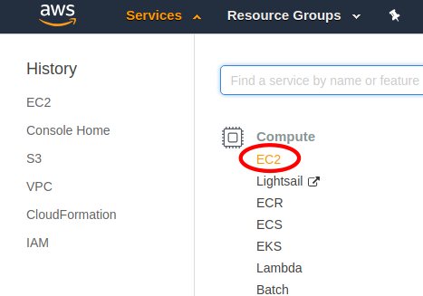
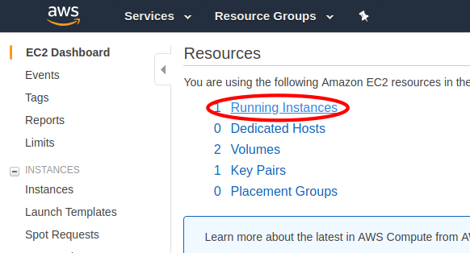
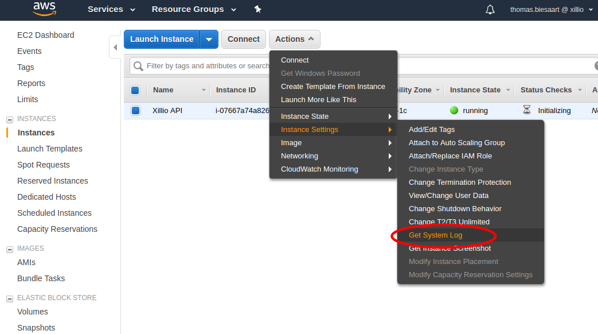
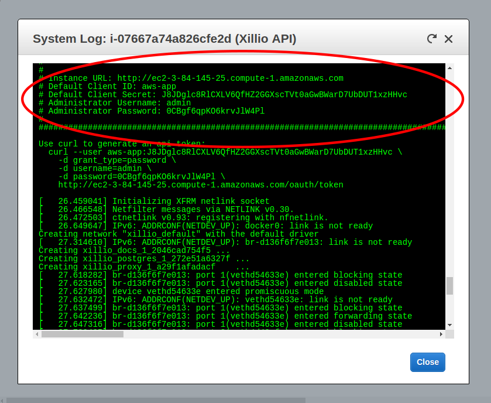

= Xillio API on AWS Marketplace
Xillio <support@xillio.com>

The Xillio API is a platform with which developers can effortlessly build integrations with all popular content
repositories. It is designed to make developers more productive when they need to integrate content from different
repositories.

.Getting Started
****

<<server-credentials>>

<<database-credentials>>

****

[#server-credentials]
== Obtain Credentials

=== What Credentials Do I Need?

=== Find Xillio API Credentials

There are two ways to find the generated Xillio API credentials. If you have ssh access you can get the credentials
by <<ssh, logging in through ssh>>. If you do not have ssh access you can get the credentials <<system-logs, from the
system logs>>.

[#ssh]
==== Method 1: Obtain Credentials Through SSH

[#system-logs]
==== Method 2: Obtain Credentials From EC2 System Logs

NOTE: The system log is only available the first 12 hours after you first start the instance. It may also take up to 20
minutes for the system logs to show up.

1. Log in to the https://console.aws.amazon.com/console/home[AWS Console].
2. Open the EC2 Dashboard in services.
+

3. Click 'Running Instances'
+

4. Select your Xillio API instance
+
image::./images/select-instance.png[align="center"]
5. Open the system logs
+

6. Find the credentials in the logs. They are usually around the bottom of the logs if you have just launched the instance.
+

[#database-credentials]
== Obtain PostgreSQL Credentials

