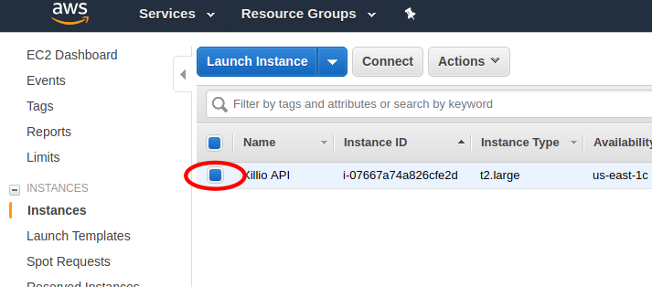

[obtain-credentials]
= Obtain Credentials

There are two ways to find the generated Xillio API credentials. If you have ssh access you can get the credentials
by <<ssh, logging in through ssh>>. If you do not have ssh access you can get the credentials <<system-logs, from the
system logs>>.

[#ssh]
== Method 1: Through SSH

1. Find the public dns of your instance.
// TODO: Should I explain how to get public dns?
2. Log on using the `ec2-user` username and you ssh key.
+
[source,bash]
----
$ ssh ec2-user@ec2-3-84-145-25.compute-1.amazonaws.com
Last login: Thu Jan  3 08:13:43 2019 from 1.2.3.4

       __|  __|_  )
       _|  (     /   Amazon Linux AMI
      ___|\___|___|

https://aws.amazon.com/amazon-linux-ami/2018.03-release-notes/
2 package(s) needed for security, out of 2 available
Run "sudo yum update" to apply all updates.
----
3. Navigate to `/opt/xillio-api/data`.
+
[source,bash]
----
$ cd /opt/xillio-api/data
----
4. Open `config.env`.
+
[source,bash]
----
$ nano ./config.env

client_id=aws-app
client_secret=J8JDglc8RlCXLV6QfHZ2GGXscTVt0aGwBWarD7UbDUT1xzHHvc
admin_username=admin
admin_password=0CBgf6qpKO6krvJlW4Pl
jwt_secret=eLQFNU6b4sXsOUYFEyDA4ssZyVIg2tcIL3UVpbECxKtRrT6p8hovOHyNfPq
postgresql_username=xrL9ZQU460QnY8rYs8xAUEmJUWBb7fbbasxl1rYr9SBewucexI
postgresql_password=7eEhC0J5aY1VDt2N7Eq8GVJKMZA46jzkwQvvNbVmmecerGYnfm

----
5. Store the credentials in a safe place.
6. Remove user credentials.
+
[source,bash]
----
client_id=
client_secret=
admin_username=
admin_password=
jwt_secret=eLQFNU6b4sXsOUYFEyDA4ssZyVIg2tcIL3UVpbECxKtRrT6p8hovOHyNfPq
postgresql_username=xrL9ZQU460QnY8rYs8xAUEmJUWBb7fbbasxl1rYr9SBewucexI
postgresql_password=7eEhC0J5aY1VDt2N7Eq8GVJKMZA46jzkwQvvNbVmmecerGYnfm
----
7. Press `Ctrl+X`, `Y`, and then `Enter` to save the changes.

[#system-logs]
== Method 2: From EC2 System Logs

NOTE: The system log is only available the first 12 hours after you first start the instance. It may also take up to 20
minutes for the system logs to show up.

1. Log in to the https://console.aws.amazon.com/console/home[AWS Console].
2. Open the EC2 Dashboard in services.
+
image::./images/open-ec2.png[align="center"]
3. Click 'Running Instances'.
+
image::./images/open-instances.png[align="center"]
4. Select your Xillio API instance.
+

5. Open the system logs from the actions menu.
+
image::./images/open-log.png[align="center"]
6. Find the credentials in the logs. They are usually around the bottom of the logs if you have just launched the instance.
+
image::./images/read-log.png[align="center"]
